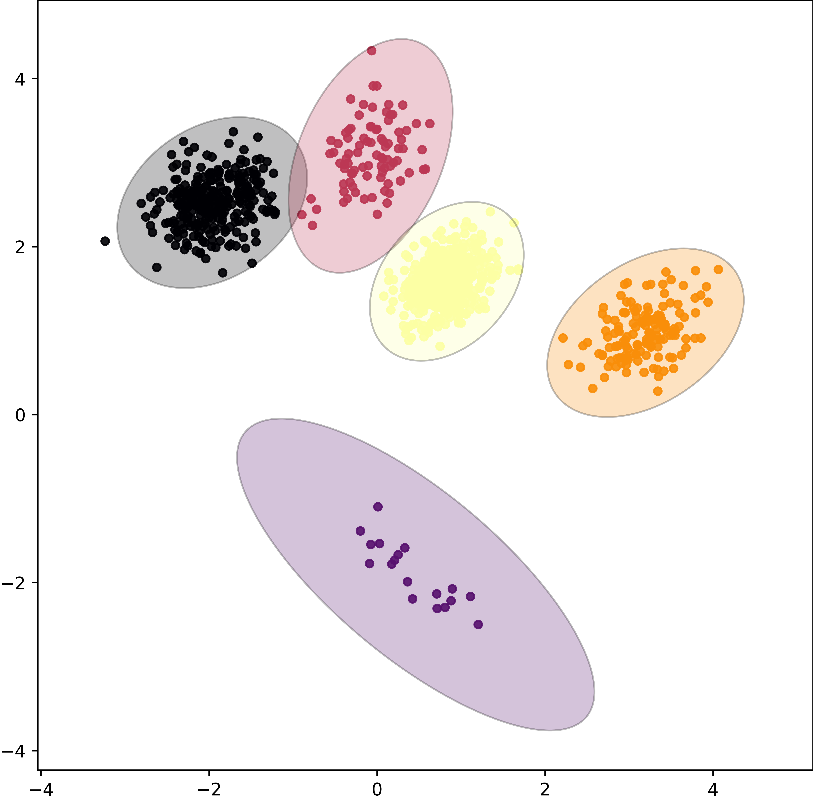
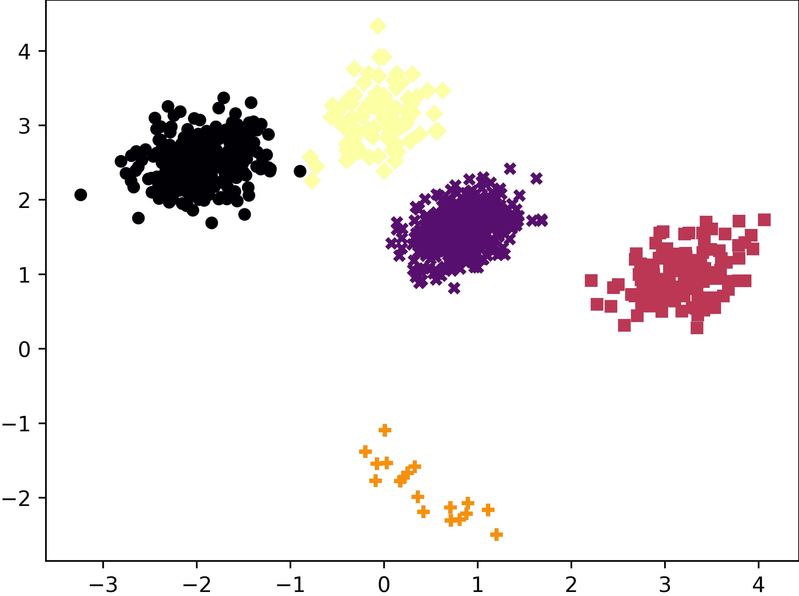

.. _examples_page:

Examples
========

Below we'll show a few examples of how to use HAWKS, ranging from quick examples to more complex uses. More complex examples will be given in :ref:`plotting_page` and :ref:`experiments_page`.

The output of these examples is not meant to be demonstrative, but not necessarily interesting or reflective of actual research. For that, please see our `paper <https://doi.org/10.1145/3321707.3321761>`_.

.. _quick_example_section:

Quick example (alongside ``scikit-learn``)
------------------------------------------

This first example will just run HAWKS with mostly default values, and then run :class:`sklearn.cluster.KMeans` on dataset that is closest to our (default) target silhouette width.

.. simple-example-marker-start

.. literalinclude:: examples/simple_example.py
    :language: python

Output:

.. code-block:: python

    ARI: 0.9984430580527084

    The dataset produced by the code above.

    The predictions made by :class:`~sklearn.cluster.KMeans` on the above dataset.

.. simple-example-marker-end

.. _example_multiconfig:

Multi-config
------------

This simple example shows how to write a config that specifies multiple combinations of parameters. Any lists of values in the config will create a single config per combination of parameters. In the example below, with have 3 targets for the silhouette width, and 2 values for the number of clusters, creating 6 combinations of parameters. Each of these combinations is then run twice, for a total of 12 runs.

Although this is useful for creating many datasets with different properties, the combinatorial nature of this appraoch can easily generate a very large number of runs. A warning is issued when more than 1,000 runs are specified, though this is set arbitrarily.

HAWKS uses ``tqdm``, which can provide an estimate of running time during the run so early diagnosis of the feasibility of a run can be seen.

.. literalinclude:: examples/multi_config.py
    :language: python

.. rst-class:: sphx-glr-script-out

Output:

 .. code-block:: none

          config_id  silhouette_target  num_clusters  run  indiv  gen  silhouette  fitness_silhouette  eigenval_ratio   overlap  best_indiv
    493           0                0.2             3    0      3   49    0.382799            0.182799       18.690280  0.014000           1
    999           0                0.2             3    1      9   49    0.197962            0.002038        8.425182  0.047000           1
    1497          1                0.2            10    0      7   49    0.199751            0.000249       10.316192  0.222445           1
    1990          1                0.2            10    1      0   49    0.200612            0.000612       19.908191  0.119119           1
    2492          2                0.5             3    0      2   49    0.536548            0.036548        8.785552  0.043000           1
    2999          2                0.5             3    1      9   49    0.495611            0.004389       13.110054  0.115000           1
    3490          3                0.5            10    0      0   49    0.499692            0.000308        5.532889  0.098196           1
    3991          3                0.5            10    1      1   49    0.498973            0.001027       13.984040  0.032032           1
    4493          4                0.8             3    0      3   49    0.802103            0.002103       18.790101  0.002000           1
    4990          4                0.8             3    1      0   49    0.799549            0.000451        8.724265  0.001000           1
    5496          5                0.8            10    0      6   49    0.799995            0.000005       19.161757  0.018036           1
    5990          5                0.8            10    1      0   49    0.799931            0.000069       18.494468  0.008008           1

.. todo::

    Add further examples.