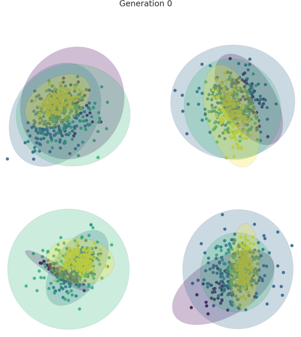

.. HAWKS documentation master file, created by
   sphinx-quickstart on Mon Jan 20 12:17:54 2020.
   You can adapt this file completely to your liking, but it should at least
   contain the root `toctree` directive.

Welcome to HAWKS's documentation!
=================================

.. toctree::
    :caption: Introduction
    :maxdepth: 2
    :hidden:

    examples
    changelog
    contributing
    testing

.. include:: ../../README.rst
  :start-after: summary-marker-1-start
  :end-before: summary-marker-1-end

The associated `repo <https://github.com/sea-shunned/hawks>`_ for this documentation is associated with the following paper:

.. include:: ../../README.rst
  :start-after: paper-marker-1-start
  :end-before: paper-marker-1-end

If you use HAWKS to generate data that forms part of a paper, please cite the paper above and link to the `repo <https://github.com/sea-shunned/hawks>`_.

.. Quick Links
.. ===========

.. * :ref:`Examples<examples_page>`
.. * :ref:`Parameters<param_page>`
.. * :ref:`Plotting<plot_page>`
.. * :ref:`Running experiments<experiment_page>`
.. * :ref:`Changelog<changelog_page>`
.. * :ref:`Extending/contributing<contrib_page>`

.. include:: ../../README.rst
  :start-after: installation-marker-start
  :end-before: installation-marker-end

or by cloning the `repo <https://github.com/sea-shunned/hawks>`_. HAWKS was written for Python 3.6+. Other dependencies are specified in the `setup.py <https://github.com/sea-shunned/hawks/blob/master/setup.py>`_ file.

Quick Example
=============

.. include:: examples.rst
  :start-after: simple-example-marker-start
  :end-before: simple-example-marker-end

.. toctree::
    :caption: Using HAWKS
    :maxdepth: 2
    :hidden:

    the_generator
    parameters
    plotting
    running_experiments

.. toctree::
    :caption: HAWKS Docs
    :maxdepth: 2
    :hidden:

    hawks