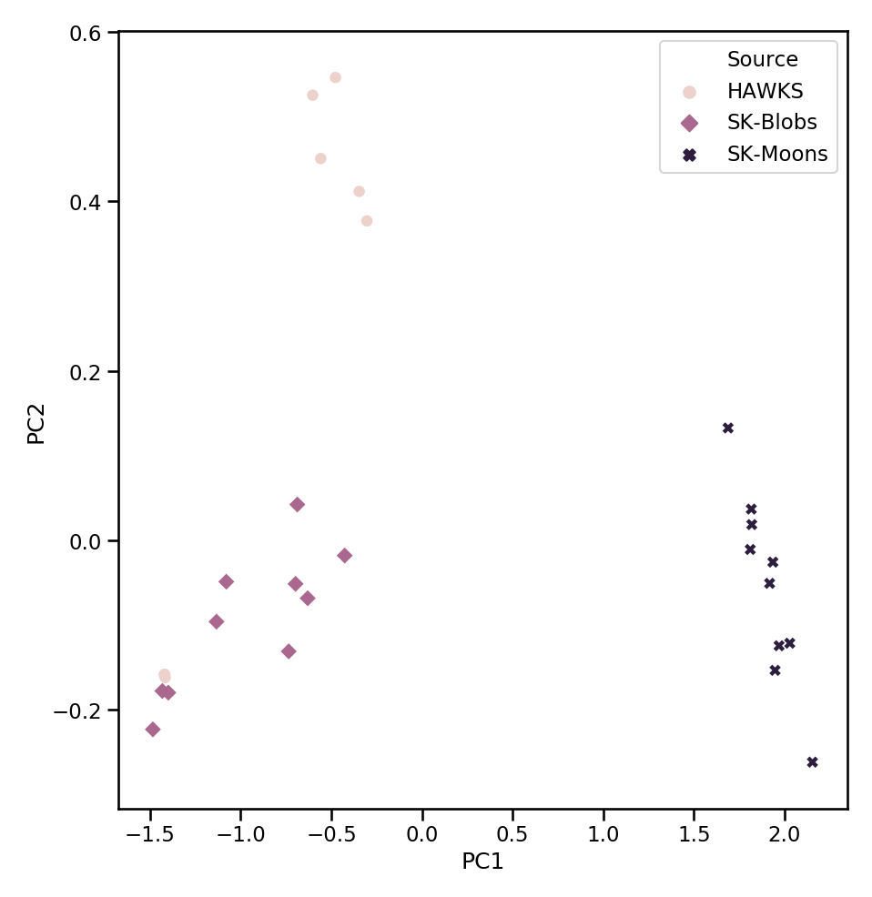
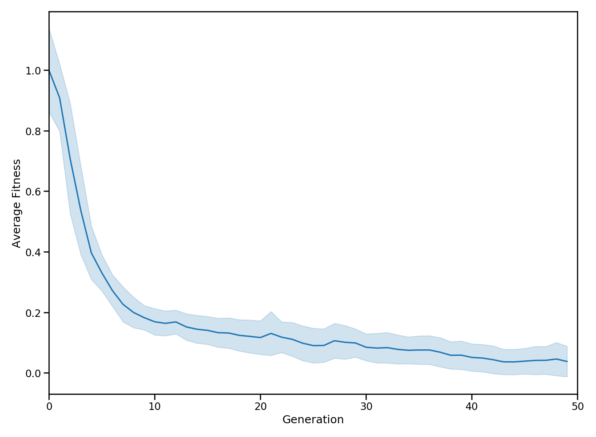
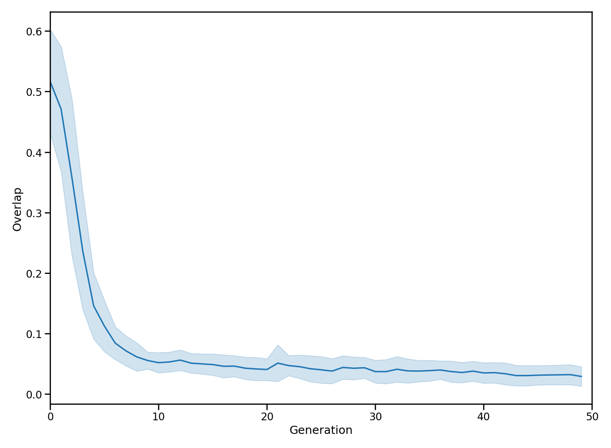

.. _plotting_page:

Plotting
========

In this section we'll cover some of main plotting functionality within HAWKS. For full documentation of the plotting functions, see :mod:`hawks.plotting`.

As with the :ref:`examples_page`, the images and code shown here are demonstrative and are not intended to show *actual research*.

.. _instance_space_example:

Instance space
--------------

For visualizing the datasets according to their problem features (or meta-features), we can plot the instance space. :class:`~sklearn.decomposition.PCA` is used to reduce the problem features down to 2D. For more about instance spaces, see our `paper <https://doi.org/10.1145/3321707.3321761>`_, or e.g. `this work <https://link.springer.com/article/10.1007/s10994-017-5629-5>`_.

.. literalinclude:: examples/instance_example.py
    :language: python

Output:

    The instance space of the three sets of datasets.

Visualizing convergence
-----------------------

AS HAWKS is underpinned by an evolutionary algorithm, it's useful to be able to visualize convergence of the algorithm to better understand the optimization. For this, :func:`hawks.plotting.convergence_plot` provides a general function for plotting this. By default, the fitness is used for the y-axis, though this can be controlled by the ``y`` argument (as long as it matches a column in the :attr:`~hawks.generator.BaseGenerator.stats` DataFrame).

.. literalinclude:: examples/convergence_example.py
    :language: python

Output:

    Convergence of the fitness

    Convergence of the overlap

.. todo::

    Add further examples.